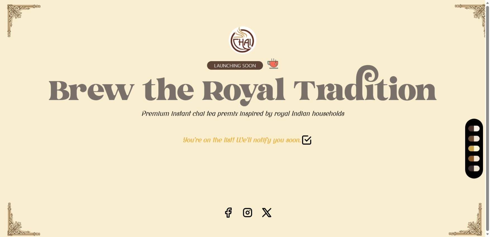

🍵 Chai Circle – Coming Soon Landing Page

A modern, royal-themed “Coming Soon” landing page for Chai Circle, a premium instant chai tea premix inspired by royal Indian households.
Built with performance, responsiveness, and brand storytelling in mind.

  

✨ Features

Royal & elegant UI inspired by Indian heritage

Responsive design (mobile-first)

Dynamic color palette switcher

Email notification signup

Smooth layout and clean typography

Social media integration

Reusable React components

Optimized for fast loading

🧱 Tech Stack

React.js

Tailwind CSS

Framer Motion (for animations)

Vite (development & build)

Modern CSS & SVG icons

🎨 Design Direction

Tagline: Brew the Royal Tradition

Color Palette: Browns, creams, golds

Typography: Elegant display font for headings

Mood: Warm, royal, premium

📱 Responsive Support

Mobile ✔️

Tablet ✔️

Desktop ✔️

Tested across multiple screen sizes for consistent experience.

🚀 Getting Started
1. Clone the repository
git clone https://github.com/fit-edoc/Frontend_assignment

2. Install dependencies
npm install

3. Start development server
npm run dev

4. Build for production
npm run build

